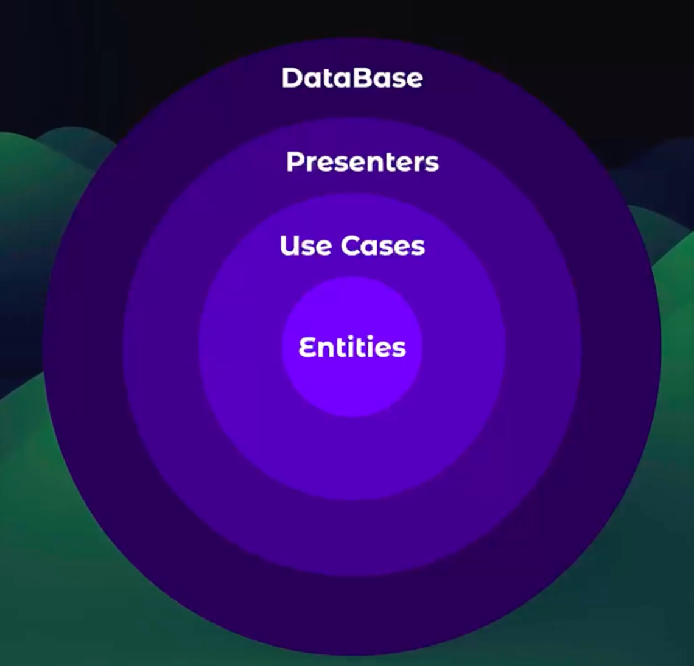

Robert C. Martin - Propuso la implementación de la arquitectura limpia.

La comunicación se realiza de los circulos exteriores a los circulos interiores y los circulos interiores no se comunican con los circulos exteriores.

### Consideraciones 

No debería afectar si:

1. Cambiamos la base de datos
2. Cambiamos alguna dependencia
3. Añadimos o eliminamos funciones
4. Queremos trabajar con múltiples orígenes de datos o destinos